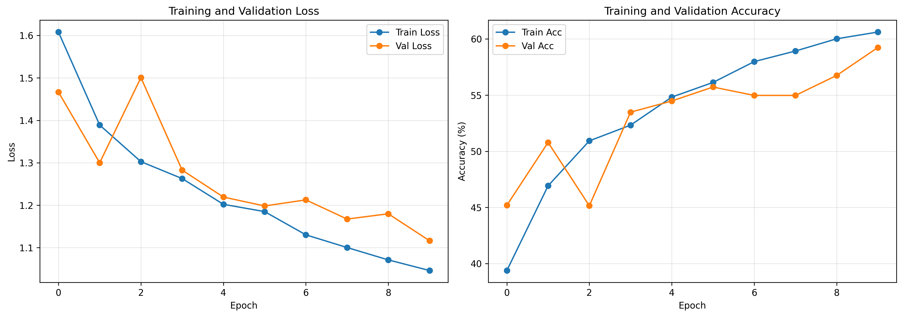
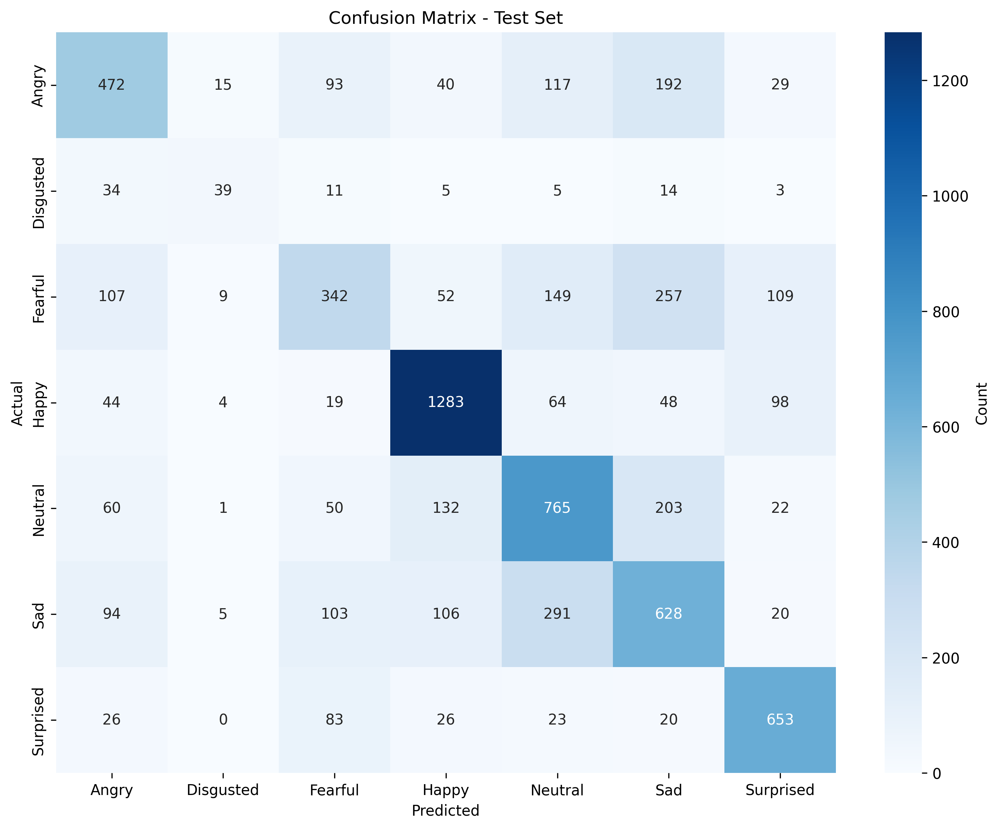
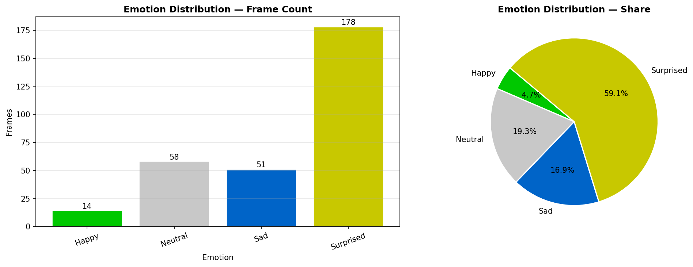

 # 🎭 Emotion Detection in Social Media using Deep Learning

<p align="center">

Deep Learning • Computer Vision • PyTorch • CUDA • OpenCV

</p>

<p align="center">


</p>

---

# 📖 Table of Contents

- Overview
- Features
- Dataset
- Tech Stack
- Hardware Acceleration
- Model Architecture
- Performance
- Sample Outputs
- Project Structure
- Installation
- Usage
- Future Improvements
- Author
- License

---

# 📌 Overview

Emotion Detection in Social Media is a Deep Learning and Computer Vision project that automatically classifies human facial expressions into **seven emotion categories** using **Transfer Learning** with **ResNet18**.

The project supports emotion recognition from both **images** and **videos** while utilizing **GPU acceleration (CUDA)** for faster model training and inference.

---

# ✨ Features

- 🎭 Emotion Detection from Images
- 🎥 Emotion Detection from Videos
- 🧠 Transfer Learning using ResNet18
- ⚡ GPU Accelerated Training (CUDA)
- 💾 Automatic Best Model Saving
- 📊 Confusion Matrix Generation
- 📈 Training History Visualization
- 🖼 Emotion Distribution Visualization
- 📂 Clean and Modular Notebook Structure

---

# 😊 Supported Emotion Classes

| Class |
|--------|
| Angry |
| Disgust |
| Fear |
| Happy |
| Neutral |
| Sad |
| Surprise |

---

# 💾 Dataset

This project uses the **FER2013 Facial Expression Dataset**.

Download the dataset from Kaggle and place it inside the project directory:

```text
train/
test/
```

The dataset contains facial images categorized into seven emotions.

---

# 🛠 Tech Stack

| Category | Technologies |
|----------|--------------|
| Programming | Python |
| Deep Learning | PyTorch, TorchVision |
| Computer Vision | OpenCV |
| Data Processing | NumPy, Pandas |
| Visualization | Matplotlib, Seaborn |
| Machine Learning | Scikit-learn |
| Progress Monitoring | tqdm |
| Development | Jupyter Notebook |

---

# ⚡ Hardware Acceleration

The project automatically detects GPU availability and switches between CUDA and CPU execution.

```python
device = torch.device("cuda" if torch.cuda.is_available() else "cpu")
```

| Device | Supported |
|---------|-----------|
| NVIDIA GPU (CUDA) | ✅ |
| CPU | ✅ |

Using CUDA significantly reduces training time compared to CPU-only execution.

---

# 🏗 Model Architecture

```text
FER2013 Dataset
        │
        ▼
Image Preprocessing
        │
        ▼
Data Augmentation
        │
        ▼
Transfer Learning (ResNet18)
        │
        ▼
GPU Training (CUDA)
        │
        ▼
Validation
        │
        ▼
Best Model Saved
        │
        ▼
Prediction
```

---

# 📊 Model Configuration

| Parameter | Value |
|-----------|-------|
| Model | ResNet18 |
| Framework | PyTorch |
| Dataset | FER2013 |
| Number of Classes | 7 |
| Image Size | 224 × 224 |
| Batch Size | 32 |
| Optimizer | Adam |
| Loss Function | CrossEntropyLoss |
| Device | CUDA GPU / CPU |
| Transfer Learning | Yes |

---

# 📈 Training Results

## Training History

<p align="center">



</p>

---

## Confusion Matrix

<p align="center">



</p>

---

## Emotion Distribution

<p align="center">



</p>

---

# 📂 Project Structure

```text
emotion-detection-in-social-media/
│
├── checkpoints/
│   ├── best_model.pth
│   ├── final_model.pth
│   ├── confusion_matrix.png
│   └── training_history.png
│
├── outputs/
│   └── emotion_distribution.png
│
├── train/
├── test/
│
├── emotion.ipynb
├── emotion_detection_training.ipynb
├── predict_image.ipynb
├── predict_video_fixed.ipynb
│
├── sample.jpg
├── README.md
├── requirements.txt
├── .gitignore
└── LICENSE
```

---

# 📋 Requirements

- Python 3.10+
- PyTorch
- CUDA (Optional)
- NVIDIA GPU (Recommended)

Install all dependencies using:

```bash
pip install -r requirements.txt
```

---

# 🚀 Installation

Clone the repository

```bash
git clone https://github.com/Amit-Yadav1231/emotion-detection-in-social-media.git
```

Move inside the project directory

```bash
cd emotion-detection-in-social-media
```

Install dependencies

```bash
pip install -r requirements.txt
```

---

# ▶️ Usage

## Train the Model

Open

```text
emotion_detection_training.ipynb
```

Run all notebook cells.

---

## Image Prediction

Open

```text
predict_image.ipynb
```

Run all notebook cells.

---

## Video Prediction

Open

```text
predict_video_fixed.ipynb
```

Run all notebook cells.

---

# 🚀 Future Improvements

- Real-Time Webcam Emotion Detection
- FastAPI REST API
- Streamlit Web Application
- Docker Support
- Hugging Face Spaces Deployment
- ONNX Model Export
- TensorRT Optimization
- Model Quantization
- Mobile Application

---

# 🙏 Acknowledgements

- PyTorch
- TorchVision
- OpenCV
- FER2013 Dataset
- Scikit-learn

---

# 👨‍💻 Author

## Amit Kumar Yadav

**B.Tech Computer Science & Engineering**

Machine Learning • Deep Learning • Computer Vision

GitHub: **https://github.com/Amit-Yadav1231**

---

# 📜 License

This project is licensed under the **MIT License**.
